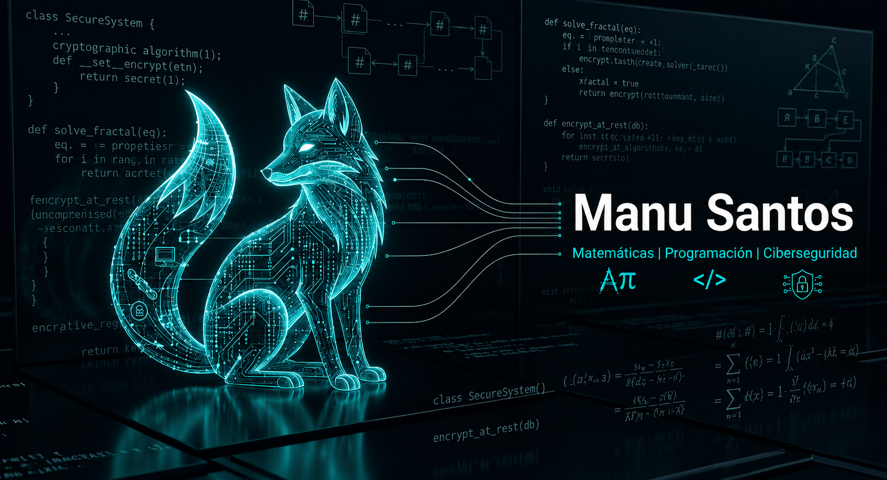

  

# 🦊 ¡Hola! Soy Manu Santos

**Estudiante de Matemáticas | Programador | Entusiasta de la Ciberseguridad**

Como estudiante del Grado en Matemáticas en la Universidad de Málaga, descubrí que mi verdadera vocación no está solo en resolver abstracciones en un papel, sino en utilizar esa lógica pura para diseñar algoritmos eficientes y proteger arquitecturas de red. Mi objetivo profesional es ser el puente entre el rigor matemático, el desarrollo de software y la ciberseguridad corporativa.

Me dedico a buscar el punto exacto donde la teoría choca con el mundo real. Si un problema tiene solución, intento demostrarla y programarla; y si alguien intenta vulnerarla... trabajo para asegurarla.

### 🎯 Mi Foco Actual
* 🛡️ Explorando el lado ofensivo y defensivo de la ciberseguridad (Hacking Ético, Criptografía).
* ⚛️ Trasteando con **Computación Cuántica** e implementando circuitos con Qiskit.
* 🧠 Entrenando mi cerebro matemático para pensar como un atacante y defender como un criptoanalista.

### 🛠️ Stack Tecnológico
**Lenguajes y Paradigmas**

**Matemáticas, Datos y Entornos**

**Flujos de Trabajo & IA (El arte del Vibe Coding)**

> **🤖 Mi relación con el Desarrollo Web**
> Si te fijas, en mi *stack* no hay medallas de HTML, CSS o JavaScript. No es que les tenga manía, es que prefiero usarlos en modo director de orquesta. Aplico el *vibe coding*: me centro en diseñar la arquitectura lógica, resolver los rompecabezas matemáticos y pensar en los vectores de ataque. Luego, me apoyo en la Inteligencia Artificial para que pique el código de la interfaz por mí. Digamos que sé hablar exactamente el idioma de las máquinas para que ellas hagan el trabajo sucio mientras yo me quedo con la parte divertida.

### 🌐 Dónde encontrarme

---
> *"En matemáticas no entiendes las cosas. Solo te acostumbras a ellas."* - John von Neumann
